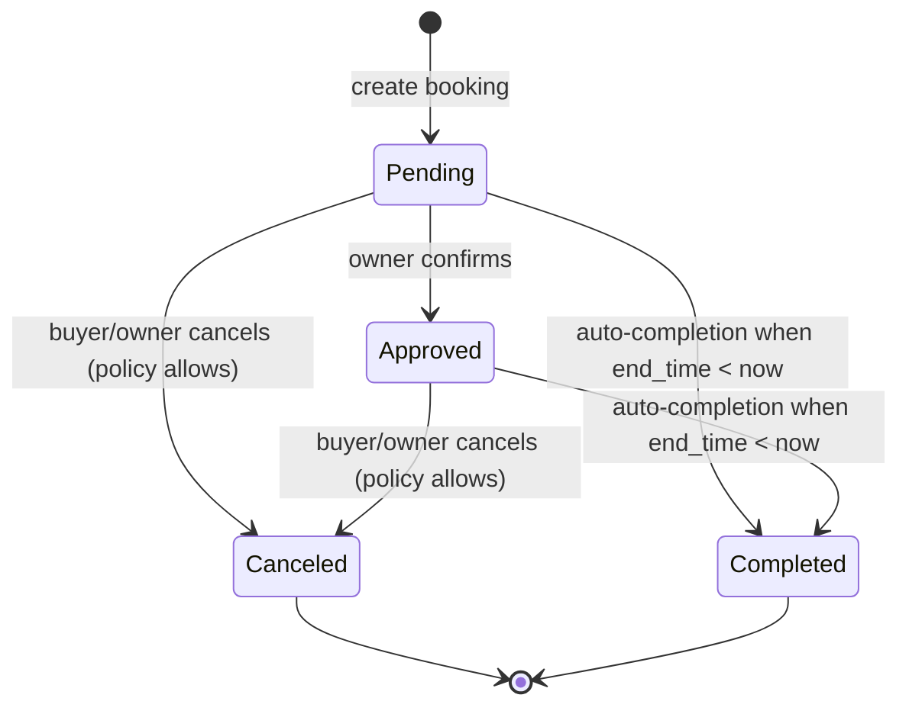

# Parky - Real-Time Parking Marketplace

Parky is a Django-based marketplace for student parking rentals, designed as an event-driven web platform rather than a static listing site. The system combines strict backend validation, real-time notifications, geospatial UX, Docker-based deployment, and CI/CD automation to support reliable booking flows under concurrent user activity.

The production website is available at: https://parky-app.me

This repository is intentionally architecture-heavy: most business constraints are enforced server-side and modeled explicitly in the domain layer.

## Table of Contents

- [System Overview](#system-overview)
- [Backend Engineering Impact](#backend-engineering-impact)
- [Technical Architecture](#technical-architecture)
- [Backend and Business Logic](#backend-and-business-logic)
- [Backend Guarantees and Operational Rules](#backend-guarantees-and-operational-rules)
- [Booking State Machine and Lifecycle](#booking-state-machine-and-lifecycle)
- [Real-Time Architecture](#real-time-architecture)
- [Geospatial and Frontend Integration](#geospatial-and-frontend-integration)
- [Security and DevOps](#security-and-devops)
- [Production Deployment](#production-deployment)
- [CI/CD](#cicd)
- [Dockerized Development](#dockerized-development)
- [Project Structure](#project-structure)
- [Development Methodology (AI Collaboration)](#development-methodology-ai-collaboration)
- [Technical Glossary](#technical-glossary)
- [Local Setup](#local-setup)
- [License](#license)

## System Overview

Parky supports two primary actor roles:

- **Parking owners** publish parking spaces with availability constraints (date range, time window, weekdays, legal declaration).
- **Drivers/students** book available slots, receive real-time status updates, and rate completed bookings.

The platform design emphasizes:

1. **Data integrity:** booking slot consistency and vehicle identity validation.
2. **State correctness:** explicit booking lifecycle states.
3. **Responsiveness:** event-driven notifications over WebSockets.
4. **Operational simplicity:** containerized deployment with PostgreSQL and Redis.

## Backend Engineering Impact

This project demonstrates backend validation, state management, real-time delivery, deployment automation, and data integrity under real user workflows
### Delivered Backend Capabilities

- **Layered validation path:** form-level parsing (`BookingForm`, `ProfileUpdateForm`) and domain-level invariants (`Booking.clean`) prevent invalid state transitions.
- **Temporal integrity controls:** chronological checks, past-time rejection, weekday gates, date-window gates, and hour-window gates are enforced server-side.
- **Collision prevention strategy:** interval-overlap detection blocks double-booking for `pending`/`approved` reservations on the same parking space.
- **Identity integrity integration:** external Israeli government data is queried in real time for license plate verification; Israeli phone standards are enforced via `django-phonenumber-field`.
- **Operational policy enforcement:** self-booking prevention, cancellation cutoff policy, and role-based ownership constraints are validated in backend workflows.
- **Reputation and trust loop:** completed-booking-only ratings, one-time rating constraint, aggregate owner scoring, and report-based moderation signals.
- **Deployment automation:** Dockerized runtime and GitHub Actions CI/CD support repeatable builds and test execution.

### Quantified System Scope (Current Implementation)

- **6 core domain models:** `ParkingSpace`, `Booking`, `Profile`, `Notification`, `Report`, plus Django `User` integration.
- **4 booking lifecycle states:** `pending`, `approved`, `canceled`, `completed`.
- **7 weekday availability flags:** Sunday-Saturday control at model level.
- **2 external government datasets:** fallback verification chain for vehicle plate validation.
- **1 realtime notification channel per user:** group-based event fan-out via `user_<id>`.
- **98% test coverage:** the project includes automated tests covering models, forms, and views.

These choices were made to reduce hidden state bugs, limit race-condition surface area in application logic, and keep business rules auditable in code.

## Technical Architecture

Parky is structured around Django's layered architecture with Channels on top of ASGI:

- **Presentation layer:** Django templates + JavaScript clients (`parking/templates/`).
- **Application layer:** Django views orchestrating workflows (`parking/views.py`).
- **Domain layer:** model-level invariants in `Booking.clean()` and `ParkingSpace.save()` (`parking/models.py`).
- **Integration layer:** external API requests for vehicle validation (`parking/forms.py`).
- **Event layer:** Channels consumer + group messaging (`parking/consumers.py`, `parking/utils.py`, `parking/routing.py`).

At runtime:

- HTTP requests are served via Django ASGI app.
- WebSocket connections are routed via `ProtocolTypeRouter` and `AuthMiddlewareStack` (`parky_project/asgi.py`).
- Notification events are fan-out pushed to per-user channel groups (`user_<id>`).

## Backend and Business Logic

### 1) Booking Slot Validation and Collision Prevention

Core booking correctness is enforced in `Booking.clean()` in `parking/models.py`.

#### Chronological Validation

- `start_time` and `end_time` are mandatory.
- Hard invariant: `start_time < end_time`.
- Booking in the past is rejected for new bookings.

#### Availability Window Validation

For a selected parking space, server-side checks enforce:

- Date range constraints (`start_date`, `end_date`).
- Daily time window constraints (`available_from`, `available_to`).
- Day-of-week constraints (`available_sun` ... `available_sat`).

This ensures frontend widgets are not the only gatekeeper; business rules remain trusted even if requests are forged.

#### Overlapping Booking Prevention

Slot collision logic rejects any overlap with existing bookings in active states:

- Overlap condition: `existing.start_time < new.end_time AND existing.end_time > new.start_time`.
- State filter: only `pending` and `approved` are considered blocking.
- Self-exclusion on update: `.exclude(id=self.id)`.

This is an application-level protection against logical race conditions in common traffic. For stronger guarantees under high concurrency, this pattern can be extended with transactional locking or database-level exclusion constraints.

Concurrency note:

- In a high-traffic scenario, two parallel requests can pass validation nearly simultaneously before either transaction commits.
- The current implementation enforces correctness at the application layer (`Booking.clean()`), which is strong for normal load and clear in business intent.
- The architecture is intentionally extensible to database-enforced atomicity:
  - **Transactional locking:** wrap booking creation in `transaction.atomic()` and lock candidate rows with `select_for_update()`.
  - **Database exclusion constraints (PostgreSQL):** enforce non-overlapping time ranges for the same parking space at the storage engine level.
- This hardening path is important for distributed/system-scale deployments where process-level checks alone are not always sufficient.

### 2) Vehicle License Plate Verification via Israel Government Open Data API

`ProfileUpdateForm.clean_license_plate()` (`parking/forms.py`) verifies license plate integrity before persistence.

Implementation details:

- Endpoint: `https://data.gov.il/api/3/action/datastore_search`.
- Two independent `resource_id` datasets are queried sequentially.
- Network calls use request timeouts (`timeout=10`, fallback `timeout=5`).
- Validation accepts if a matching record exists in either dataset.
- API failures are converted to user-facing `ValidationError` responses.
- Unknown plate values are rejected with explicit validation feedback.

This design reduces false acceptance and improves resilience against transient external API issues.

### 2.1) Israeli Phone Number Validation (External Library)

Phone data integrity is enforced through the `django-phonenumber-field` stack:

- `Profile.phone_number` is defined as `PhoneNumberField(unique=True, blank=True, null=True)` in `parking/models.py`.
- `PHONENUMBER_DEFAULT_REGION = 'IL'` in `parky_project/settings.py` sets Israeli parsing defaults.
- `ProfileUpdateForm` in `parking/forms.py` enforces form-level validation and user-facing error messages.

Why this matters:

- Prevents malformed contact data from entering the system.
- Normalizes local Israeli number input behavior.
- Enforces uniqueness to reduce account/profile ambiguity during booking communication.

### 3) Data Model and State Management

Primary entities (`parking/models.py`):

- `ParkingSpace`: listing metadata, geo coordinates, availability policy.
- `Booking`: transaction record with temporal boundaries and lifecycle state.
- `Profile`: identity extensions (phone, license plate, user rating).
- `Notification`: persistent message center with read/unread status.
- `Report`: moderation and trust pipeline for parking issues.

#### Booking State Machine

`Booking.status` supports:

- `pending` -> awaiting owner decision.
- `approved` -> confirmed reservation.
- `canceled` -> canceled by owner or buyer.
- `completed` -> auto/logic-driven terminal state after end time.

Transitions are controlled in view workflows (`parking/views.py`) and constrained by role checks.

## Backend Guarantees and Operational Rules

This section captures backend workflows implemented in `parking/views.py` beyond model validation.

### Authorization and Role Enforcement

- `@login_required` protects booking, listing, profile, reporting, and rating endpoints.
- Owner-only operations are validated server-side for edit/delete/booking-management flows.
- Self-booking is explicitly blocked (`if parking_space.owner == request.user`).

### Profile and Identity Preconditions

Before creating a booking, the buyer must have:

- Verified phone number.
- Verified license plate.

This prevents incomplete identity records from entering transaction-critical flows.

### Cancellation and Status Rules

- Cancellation has a hard policy cutoff: booking cannot be canceled within 2 hours before `start_time`.
- Completion status synchronization is performed by `mark_completed_bookings(...)` when loading booking management pages.
- Status transitions are intentionally constrained around lifecycle intent: pending -> approved/canceled -> completed.

### Ratings and Reputation Aggregation

`rate_booking` enforces domain safeguards:

- Rating is allowed only for `completed` bookings.
- Double-rating is blocked (`booking.rating is not None`).
- `rated_at` is persisted for auditable rating timestamps.
- Owner reputation (`Profile.user_rating`) is updated from aggregated booking ratings (`Avg('rating')`).

### Trust and Moderation Pipeline

- `Report` domain entity captures suspected fraud/inaccurate listing issues.
- Report submission triggers owner notification events to enable corrective action.
- Notification model persistence + WebSocket push creates both auditability and immediacy.

## Booking State Machine and Lifecycle

The booking lifecycle is modeled as a state machine over `Booking.status`, with backend-enforced transitions and guard conditions.

### Mermaid State Diagram



### Lifecycle Rules (Backend-Enforced)

- **Pending:** default state on booking creation.
- **Approved:** set by owner confirmation flow in `booking_confirmation`.
- **Canceled:** set by cancellation flow in `booking_rejection` for buyer/owner contexts.
- **Completed (auto):** synchronized by `mark_completed_bookings(...)` when `end_time < timezone.now()` for active bookings.

### Auto-Completion Logic

- The system periodically normalizes stale active bookings (`pending`/`approved`) to `completed` once the booking window has elapsed.
- This avoids lingering non-terminal states and keeps lifecycle analytics and rating eligibility consistent.

### Cancellation Cutoff Policy

- Cancellation is blocked inside a strict time window: less than 2 hours before `start_time`.
- The rule is enforced server-side in `booking_rejection`, preventing client-side bypass attempts.
- This protects owners from last-minute churn and keeps booking commitments operationally reliable.

## Real-Time Architecture

Parky implements push-based notifications using Django Channels and WebSockets.

### ASGI and Routing

- `parky_project/asgi.py` defines `ProtocolTypeRouter` for `http` and `websocket`.
- WebSocket auth context is injected by `AuthMiddlewareStack`.
- Route `/ws/notifications/` is mapped in `parking/routing.py`.

### Consumer and Group Messaging

`NotificationConsumer` (`parking/consumers.py`):

- On connect, authenticated users join `user_<id>` group.
- On disconnect, channels are removed from the group.
- Incoming group events are serialized as JSON and sent to the browser.

`send_user_notification()` (`parking/utils.py`) publishes domain events to a user group with payload fields:

- `message`
- `title`
- `notif_type`
- `target_url`

This forms an event-driven architecture for domain actions such as new booking requests and status changes.

### Unread Counter and Dynamic Badges

- `count_unread_notifications()` context processor computes unread counts from `Notification.is_read=False`.
- `base.html` renders the badge initially from server context.
- WebSocket events increment the badge client-side in real time and trigger toast notifications.

Result: the UI reflects notification activity without full page reloads.

## Geospatial and Frontend Integration

### Leaflet.js Integration

Leaflet is used in two core flows:

1. **Location picking when publishing a spot** (`parking/templates/parking/add_parking_space.html`)
   - User clicks map to set `lat`/`lon` hidden form fields.
   - Existing coordinates are loaded for edit mode.

2. **Map browsing of active listings** (`parking/templates/parking/map.html`)
   - Active parking records with coordinates are rendered as markers.
   - Popups include price, rating, and deep links to booking/report flows.

On the backend, `ParkingSpace.save()` attempts geocoding via `geopy.Nominatim` when coordinates are missing, providing fallback coordinate derivation from textual address.

### Flatpickr Customization and Localization

Flatpickr is configured for Hebrew UX and scheduling precision:

- Hebrew locale pack (`flatpickr/dist/l10n/he.js`).
- 24-hour time (`time_24hr: true`).
- Date and time fields split for clear booking intent.
- Min/max constraints tied to parking availability and date windows.

The final authority remains backend model validation, creating defense-in-depth between UI constraints and server rules.

## Security and DevOps

### Environment Variable Management

`parky_project/settings.py` loads environment variables from `.env` via `python-dotenv`:

- `SECRET_KEY` is sourced from environment rather than hardcoded.
- `DEBUG` is parsed from environment string.
- `ALLOWED_HOSTS` is configured from environment, which includes `parky-app.me` in production.

### Database and Runtime Configuration

The project is configured for PostgreSQL in production and uses Redis for Channels:

- PostgreSQL database settings are read from environment variables.
- Redis powers the Channels layer for real-time notifications.
- Static files are served with `whitenoise` in containerized deployments.

### `.gitignore` Strategy

`.gitignore` excludes:

- Secrets and local config (`.env`, `local_settings.py`).
- Virtual environments and caches (`.venv/`, `__pycache__/`, `*.pyc`).
- Local DB artifacts (`db.sqlite3`, journals).
- IDE and OS noise (`.idea/`, `.vscode/`, `.DS_Store`, `Thumbs.db`).
- Uploaded media files (`media/*`) while preserving `media/README.md`.

## Production Deployment

Parky is deployed as a production web application at `https://parky-app.me:8000/map`.

### AWS Deployment Overview

The project is deployed on AWS using a Dockerized runtime.

Current deployment flow includes:
- GitHub Actions pipeline for build, test, and deployment steps.
- AWS EC2 deployment via SSH.
- Docker Compose-based restart on the server.

Operational notes:

- `DEBUG=False` in production.
- `ALLOWED_HOSTS` includes `parky-app.me`.
- Database runs as a containerized PostgreSQL instance on the EC2 server alongside the application.
- Channels uses a Redis-backed channel layer instead of in-memory storage.
- Static files are collected during deploy and served from production storage.
- Migrations run as part of the deployment pipeline.

## CI/CD

The project includes GitHub Actions-based CI/CD.

### Pipeline Goals

- Run automated tests on every relevant push or pull request.
- Validate the Django app in a repeatable environment.
- Support Docker-based build and deployment workflows.
- Prevent regressions before production release.

### What the pipeline covers

- Test execution for the Django app.
- Dependency installation.
- Linting or validation steps if configured in workflow files.
- Container build verification if included in the workflow.

This CI/CD setup helps keep the codebase stable while supporting frequent changes.

## Dockerized Development

The project is containerized using Docker.

### Docker setup

- `Dockerfile` builds the Django application image.
- `compose.yaml` defines:
  - `web` service for the Django app
  - `db` service for PostgreSQL
  - `redis` service for Channels
- The web container runs Django through Daphne for ASGI/WebSocket support.

### Runtime behavior

- The application runs as a containerized service instead of a local-only process.
- Postgres and Redis are provisioned as separate services for development.
- Static assets are mounted into a shared volume for container execution.

Example local Docker run:

```powershell
docker compose up --build
```

Open: `http://127.0.0.1:8000/map/`

## Project Structure

```text
Parky/
  manage.py
  db.sqlite3
  Dockerfile
  compose.yaml
  .gitignore
  parking/
    models.py
    views.py
    forms.py
    consumers.py
    routing.py
    utils.py
    context_processors.py
    templates/
    tests/
  parky_project/
    settings.py
    asgi.py
    urls.py
  .github/
    workflows/
```

## Development Methodology (AI Collaboration)

This project was developed with a transparent division of labor between human-driven architecture and AI-assisted execution.

**Human-Led (Core Engineering & Architecture):**
- Domain modeling, database schema, and state machine design.
- Core business logic: booking validation invariants, temporal collision prevention, and security rules.
- Test Engineering: Comprehensive automated testing achieving 98% coverage, utilizing structured methodologies (e.g., the AAA pattern). The `coverage` Python library was actively used during development to monitor and ensure test completeness in real time.
- Architectural decision-making: selecting PostgreSQL, Redis, Django Channels, and determining the deployment strategy.

**AI-Assisted (DevOps Mentorship & Frontend):**
- **DevOps & CI/CD:** AI was utilized as an interactive cloud infrastructure mentor. Through active Q&A and guided learning, it helped structure Docker Compose, AWS EC2 provisioning, and GitHub Actions, while the actual integration and debugging were executed manually.
- **Frontend & UI:** HTML scaffolding, map integration (Leaflet.js), Flatpickr localization, and general CSS layout.
- **Learning Resource:** AI served as a dynamic documentation tool and pair-programmer for exploring edge cases and learning advanced patterns (like testing strategies and WebSocket routing), rather than as a blind code generator.

**Summary:** AI was leveraged as a senior DevOps mentor, frontend accelerator, and learning tool. However, the core backend logic, test implementation, and system architecture decisions were strictly human-engineered.

## Technical Glossary

| Term | Meaning in Parky |
| --- | --- |
| **State Machine** | Explicit lifecycle control of `Booking.status` (`pending`, `approved`, `canceled`, `completed`) with guard conditions. |
| **Temporal Invariants** | Time-based rules that must always hold (e.g., `start_time < end_time`, no past bookings, cancellation cutoff). |
| **Race Condition** | Competing concurrent booking requests that may both appear valid without atomic coordination. |
| **Idempotency** | Repeated operations should not create invalid duplicate effects (e.g., preventing double-rating or duplicate terminal transitions). |
| **ASGI** | Asynchronous Server Gateway Interface used to serve HTTP and WebSocket protocols in one runtime (`ProtocolTypeRouter`). |
| **WebSocket Fan-out** | Event distribution to per-user groups (`user_<id>`) so notifications are pushed to all active client sessions. |
| **Transactional Locking** | Database row-level locking strategy (`select_for_update`) to serialize conflicting booking writes. |
| **Exclusion Constraint** | Database-level guarantee (typically PostgreSQL) that prevents overlapping time ranges for the same resource. |
| **CI/CD** | Automated build and test pipeline, here implemented with GitHub Actions. |
| **Containerization** | Packaging the app and its runtime dependencies into Docker images for repeatable deployment. |

## Local Setup

### Prerequisites

- Python 3.10+
- `pip`
- Docker and Docker Compose for containerized development
- Access to the required environment variables in `.env`

### Installation

```powershell
python -m venv .venv
.venv\Scripts\activate
pip install -r requirements.txt
```

Create `.env` in project root:

```env
SECRET_KEY=your-secret-key
DEBUG=True
ALLOWED_HOSTS=localhost,127.0.0.1 #if you want to run it in production add your domain
CSRF_TRUSTED_ORIGINS=http://localhost:8000,http://127.0.0.1:8000 #in production add https://your-domain.com
DB_NAME=postgres
DB_USER=postgres
DB_PASSWORD=postgres
DB_HOST=db
DB_PORT=5432
REDIS_HOST=redis
```

Run migrations and start the server:

```powershell
python manage.py migrate
python manage.py runserver
```

Or run the containerized stack:

```powershell
docker compose up --build
```

Open locally: `http://127.0.0.1:8000/map/`

## License

This project is licensed under the **MIT License**.

See `LICENSE` for the full text and usage terms.
